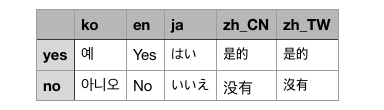

# simple-i18n
[](https://www.npmjs.com/package/@goldenthumb/simple-i18n-csv-to-json)

## Install
```sh
npm install @goldenthumb/simple-i18n-csv-to-json
```
```js
const toJson = require('@goldenthumb/simple-i18n-csv-to-json');
```

## Example


sample csv
,ko,en,ja,zh_CN,zh_TW
yes,예,Yes,はい,是的,是的
no,아니오,No,いいえ,没有,沒有

```js
import toJson from '@goldenthumb/simple-i18n-csv-to-json';

(async () => {
  try {
    const result = await toJson('./sample.csv');
    console.log(result);
  } catch(e) {
    console.log(e);
  }

  > result
  {
    ko: {
      yes: '예',
      no: '아니오'
    },
    en: {
      yes: 'Yes',
      no: 'No'
    },
    ja: {
      yes: 'はい',
      no: 'いいえ'
    },
    zh_CN: {
      yes: '是的',
      no: '没有'
    },
    zh_TW: {
      yes: '是的',
      no: '沒有'
    }
  };
})();

```

## License
MIT
